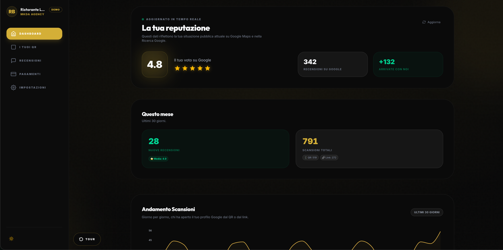
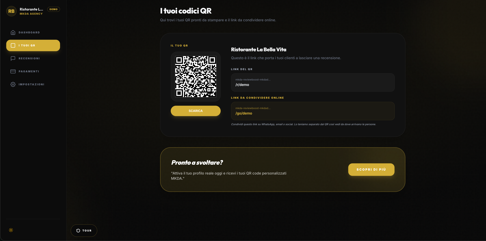
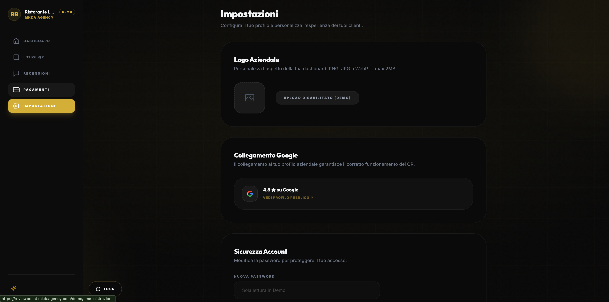

# ReviewBoost

ReviewBoost is a review management platform built by MKDA Digital Marketing Agency.

It helps businesses collect, track and improve Google reviews through QR codes, smart links and a simple analytics dashboard.

## What it does

- Generate QR codes and tracked links
- Send customers to the correct Google review page
- Track scans, clicks and traffic sources
- Monitor review activity from one dashboard
- Manage multiple clients and locations

## Product flow

1. A business shares a QR code or tracked link  
2. The customer scans or clicks  
3. ReviewBoost tracks the source  
4. The user is redirected to the Google review page  
5. The business monitors performance from the dashboard

## Built with

- Next.js
- React
- TypeScript
- Supabase
- Vercel
- Stripe
- Resend

## Live links

- Website: [mkdaagency.com/reviewboost](https://mkdaagency.com/reviewboost)
- Demo: [mkda-reviewboost.vercel.app/demo](https://mkda-reviewboost.vercel.app/demo)

## Preview

### Dashboard overview

## Built by MKDA

MKDA Digital Marketing Agency builds digital products, AI automations and marketing systems for businesses that need more visibility and better control over daily operations.

You have the project.  
We make it visible.
